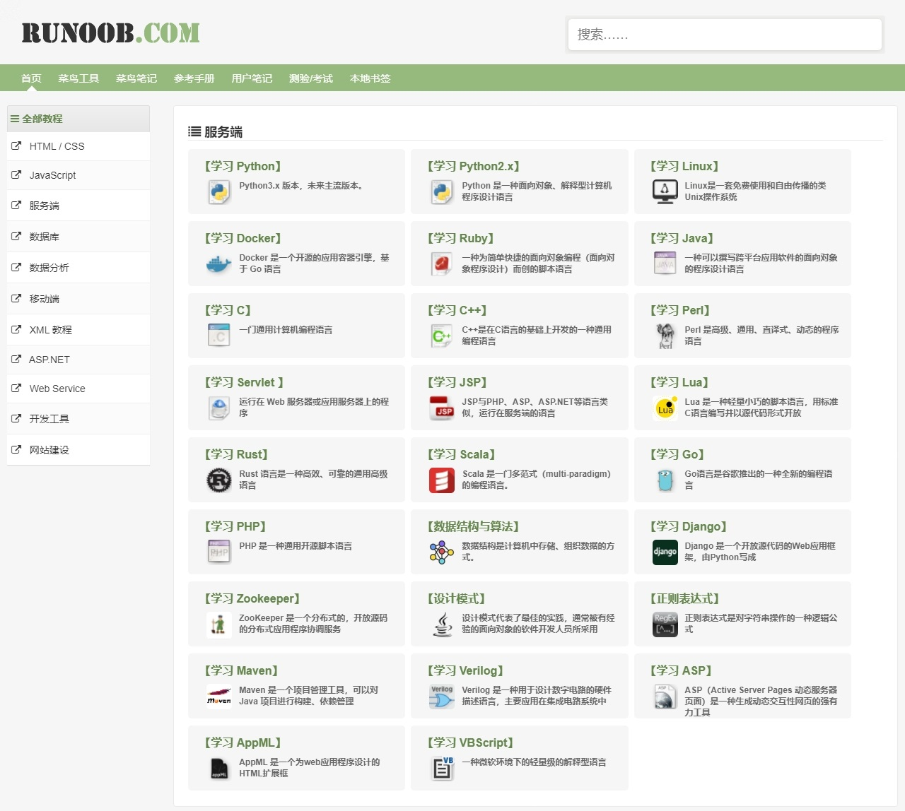
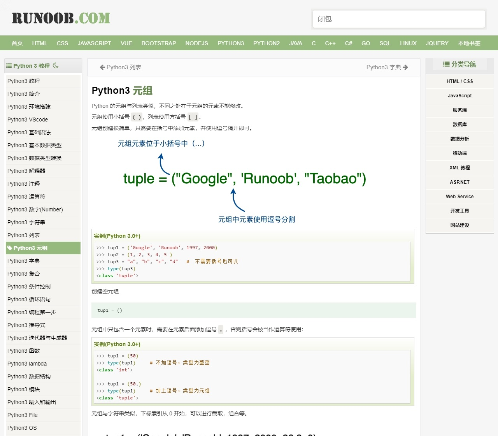
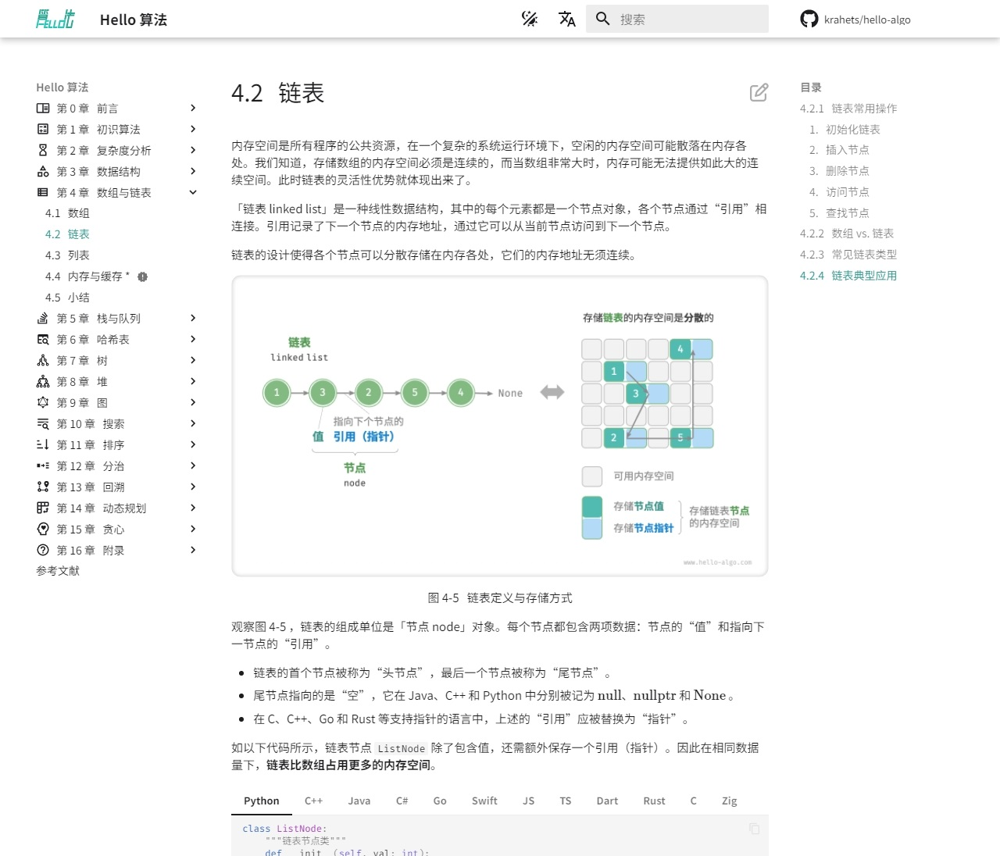

# 编程与算法学习网站

## 编程

1. [**菜鸟教程**](https://www.runoob.com/)：基本上主流的编程语言和前后端涉及的技术都有涵盖，适合初学者，但是有些内容不够深入，不过作为快速入门还是不错的。（速成法宝）
   

-- 待完善 --

## 算法

1. [**Helo算法**](https://www.hello-algo.com/)：图文并茂，分章节讲解，有各种编程语言的对应实现，涵盖了基础的数据结构和算法。

2. [**OI Wiki**](https://oi.wiki/)：主要是给想参加编程竞赛的同学准备的，讲的内容会更加偏向竞赛，难度也比较大。

-- 待完善 --